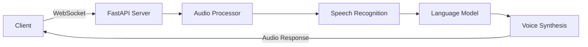

# 🎙️ AI Voice Agent Platform

A powerful, production-ready voice conversation platform that creates natural, engaging interactions using state-of-the-art AI services. Built with Retell.ai integration, this platform offers seamless real-time voice interactions with advanced AI capabilities.

<div align="center">


</div>

## ✨ Features

### 🚀 Core Capabilities
- **Real-time Voice Processing**: Ultra-low latency audio streaming and processing
- **Multiple AI Model Support**: 
  - 🧠 LLM: OpenAI GPT-4, DeepSeek
  - 👂 Speech Recognition: Deepgram Nova-2, Talkscriber
  - 🗣️ Voice Synthesis: Eleven Labs, Deepgram Voice, Cartesia

### 💫 Advanced Features
- **Intelligent Audio Processing**
  - Automatic noise reduction
  - Dynamic gain control
  - Real-time audio cleanup
  - Adaptive buffering

- **Robust Architecture**
  - WebSocket-based real-time communication
  - Session management for multiple conversations
  - Comprehensive error handling
  - Automatic service recovery
  - Detailed logging and monitoring

- **Production Ready**
  - Health check endpoints
  - Performance monitoring
  - Scalable architecture
  - CORS support
  - Rate limiting

## 🛠️ Technical Architecture



## 🚀 Quick Start

### Prerequisites

- Python 3.9+
- Required API keys:
  - Retell.ai
  - OpenAI
  - Deepgram
  - ElevenLabs

### Installation

1. Clone the repository:
```bash
git clone https://github.com/yourusername/ai-voice-agent.git
cd ai-voice-agent
```

2. Install dependencies:
```bash
python -m pip install --upgrade pip
pip install -r requirements.txt
```

3. Configure environment variables:
```bash
# Create .env file
cp .env.example .env

# Add your API keys
RETELL_API_KEY=your_retell_api_key
OPENAI_API_KEY=your_openai_api_key
DEEPGRAM_API_KEY=your_deepgram_api_key
ELEVENLABS_API_KEY=your_elevenlabs_api_key
```

### Running the Application

1. Start the server:
```bash
python app.py
```

2. Test with the provided client:
```bash
python test_client.py
```

## 📊 Performance Metrics

| Component | Latency Target |
|-----------|---------------|
| Audio Processing | < 50ms |
| Speech Recognition | < 200ms |
| LLM Response | < 500ms |
| Voice Synthesis | < 300ms |
| Total Round Trip | < 1000ms |

## 🔧 Configuration

The platform is highly configurable through `config.yaml`:

```yaml
app:
  name: AI Voice Agent
  version: 1.0.0
  environment: development

audio:
  sample_rate: 16000
  channels: 1
  chunk_size: 1024
  buffer_size: 4096

# ... (see config.yaml for full configuration)
```

## 🔒 Security

- Encrypted WebSocket connections
- API key management
- Rate limiting
- IP whitelisting support
- PII protection
- Session management

## 📈 Monitoring

- Real-time performance metrics
- Component health monitoring
- Error tracking and logging
- Usage analytics
- Cost optimization

## 🐛 Error Handling

The platform includes comprehensive error handling for:
- Network issues
- Service disruptions
- Invalid inputs
- Resource constraints
- API limits
- Timeout scenarios

## 📝 API Documentation

### WebSocket Endpoint

```typescript
ws://localhost:8000/ws/conversation

// Message format
interface AudioMessage {
  audio: Binary;  // Raw audio data
}

interface ErrorResponse {
  error: string;
  type: string;
}
```

### REST Endpoints

```http
GET /health
Response: {
  "status": "healthy" | "degraded",
  "components": {
    "speech_recognition": { "status": string },
    "language_model": { "status": string },
    "voice_synthesis": { "status": string },
    "sessions": { "active_sessions": number }
  }
}
```

## 🐳 Docker Deployment

### Prerequisites
- Docker
- Docker Compose

### Running with Docker

1. Build and start the containers:
```bash
docker-compose up -d --build
```

2. View logs:
```bash
docker-compose logs -f
```

3. Stop the containers:
```bash
docker-compose down
```

### Docker Configuration

The application is containerized with the following features:
- Base image: Python 3.9-slim
- Automatic environment variable injection
- Volume mapping for logs and development
- Health checks for all services
- Redis container for session management
- Hot-reload support for development
- Proper security configurations

### Container Management

Monitor container health:
```bash
docker-compose ps
```

View container logs:
```bash
# All containers
docker-compose logs

# Specific service
docker-compose logs voice-agent
```

Restart services:
```bash
docker-compose restart voice-agent
```

### Production Deployment

For production deployment, consider:
1. Using Docker Swarm or Kubernetes for orchestration
2. Implementing proper SSL/TLS termination
3. Setting up monitoring with Prometheus/Grafana
4. Configuring proper backup strategies
5. Implementing CI/CD pipelines

## 🤝 Contributing

1. Fork the repository
2. Create your feature branch (`git checkout -b feature/amazing-feature`)
3. Commit your changes (`git commit -m 'Add amazing feature'`)
4. Push to the branch (`git push origin feature/amazing-feature`)
5. Open a Pull Request

## 📄 License

This project is licensed under the MIT License - see the [LICENSE](LICENSE) file for details.

## 🙏 Acknowledgments

- [Retell.ai](https://retell.ai) for their amazing voice AI platform
- OpenAI for GPT-4
- Deepgram for speech recognition
- ElevenLabs for voice synthesis

## 📞 Support

For support, email alphamoris45@gmail.com.
